# Design Document: Advanced SEO

## Overview

This design document describes the architecture and implementation of an Advanced SEO system for NewsRefac (newsrefac.com). The system enhances existing SEO capabilities with comprehensive structured data generation, meta tag management, robots.txt generation, and SEO validation. The implementation follows a modular approach with pure functions for testability and integrates seamlessly with Next.js 16's metadata API.

## Architecture

```mermaid
graph TB
    subgraph "SEO System"
        Config[SEO Config]
        
        subgraph "Structured Data"
            ArticleLD[Article JSON-LD]
            OrgLD[Organization JSON-LD]
            WebsiteLD[WebSite JSON-LD]
            BreadcrumbLD[Breadcrumb JSON-LD]
            FAQLD[FAQ JSON-LD]
            HowToLD[HowTo JSON-LD]
        end
        
        subgraph "Meta Tags"
            OGTags[Open Graph]
            TwitterTags[Twitter Cards]
            Canonical[Canonical URLs]
            Hreflang[Hreflang Tags]
        end
        
        subgraph "Crawl Control"
            Robots[robots.txt]
            Sitemap[sitemap.xml]
        end
        
        Validator[SEO Validator]
    end
    
    subgraph "Pages"
        HomePage[Homepage]
        PostPage[Blog Post]
        CategoryPage[Category]
        SearchPage[Search]
    end
    
    Config --> ArticleLD
    Config --> OrgLD
    Config --> WebsiteLD
    Config --> OGTags
    Config --> Robots
    
    PostPage --> ArticleLD
    PostPage --> BreadcrumbLD
    PostPage --> OGTags
    PostPage --> TwitterTags
    PostPage --> Canonical
    PostPage --> Hreflang
    
    HomePage --> OrgLD
    HomePage --> WebsiteLD
    
    CategoryPage --> BreadcrumbLD
```



## Components and Interfaces

### 1. SEO Configuration (`lib/seo/config.ts`)

Centralized configuration for all SEO-related settings.

```typescript
interface SEOConfig {
  siteUrl: string;
  siteName: string;
  defaultLocale: Locale;
  defaultImage: string;
  twitterHandle?: string;
  facebookAppId?: string;
  socialProfiles: string[];
  organization: {
    name: string;
    logo: string;
    description: string;
  };
}

function getSEOConfig(): SEOConfig;
function validateSEOConfig(config: Partial<SEOConfig>): SEOConfig;
```

### 2. Structured Data Generators (`lib/seo/structured-data.ts`)

Pure functions for generating Schema.org JSON-LD structured data.

```typescript
// Article schema for blog posts
interface ArticleSchemaInput {
  post: Post;
  locale: Locale;
  siteUrl: string;
  siteName: string;
}

function generateArticleSchema(input: ArticleSchemaInput): ArticleJsonLd;

// Organization schema for homepage
interface OrganizationSchemaInput {
  config: SEOConfig;
}

function generateOrganizationSchema(input: OrganizationSchemaInput): OrganizationJsonLd;

// WebSite schema with search action
interface WebSiteSchemaInput {
  config: SEOConfig;
  locale: Locale;
}

function generateWebSiteSchema(input: WebSiteSchemaInput): WebSiteJsonLd;

// Breadcrumb schema for navigation
interface BreadcrumbItem {
  name: string;
  url: string;
}

function generateBreadcrumbSchema(items: BreadcrumbItem[]): BreadcrumbListJsonLd;

// FAQ schema for Q&A content
interface FAQItem {
  question: string;
  answer: string;
}

function generateFAQSchema(items: FAQItem[]): FAQPageJsonLd | null;

// HowTo schema for instructional content
interface HowToStep {
  name: string;
  text: string;
  image?: string;
}

interface HowToInput {
  name: string;
  description: string;
  steps: HowToStep[];
  totalTime?: string;
}

function generateHowToSchema(input: HowToInput): HowToJsonLd | null;
```

### 3. Meta Tag Generators (`lib/seo/meta-tags.ts`)

Functions for generating Open Graph and Twitter Card meta tags.

```typescript
interface OpenGraphInput {
  title: string;
  description: string;
  url: string;
  type: 'website' | 'article';
  locale: Locale;
  image?: {
    url: string;
    width?: number;
    height?: number;
    alt?: string;
  };
  article?: {
    publishedTime: Date;
    modifiedTime?: Date;
    author: string;
    tags: string[];
  };
  alternateLocales?: Locale[];
}

function generateOpenGraphTags(input: OpenGraphInput): OpenGraphMetadata;

interface TwitterCardInput {
  title: string;
  description: string;
  image?: string;
  card: 'summary' | 'summary_large_image';
  site?: string;
  creator?: string;
}

function generateTwitterCardTags(input: TwitterCardInput): TwitterMetadata;
```

### 4. Canonical URL Handler (`lib/seo/canonical.ts`)

Functions for generating and validating canonical URLs.

```typescript
interface CanonicalInput {
  path: string;
  locale: Locale;
  siteUrl: string;
  stripParams?: string[];
}

function generateCanonicalUrl(input: CanonicalInput): string;

function stripQueryParams(url: string, paramsToStrip: string[]): string;

function isValidCanonicalUrl(url: string, siteUrl: string): boolean;
```

### 5. Robots.txt Generator (`app/robots.ts`)

Dynamic robots.txt generation based on environment.

```typescript
interface RobotsConfig {
  siteUrl: string;
  isProduction: boolean;
  disallowPaths: string[];
  sitemapUrl: string;
}

function generateRobotsTxt(config: RobotsConfig): string;
```

### 6. SEO Validator (`lib/seo/validator.ts`)

Validation functions for SEO metadata.

```typescript
interface SEOValidationResult {
  isValid: boolean;
  errors: SEOValidationError[];
  warnings: SEOValidationWarning[];
}

interface SEOValidationError {
  field: string;
  message: string;
  value?: string;
}

interface SEOValidationWarning {
  field: string;
  message: string;
  suggestion?: string;
}

interface SEOMetadataInput {
  title: string;
  description: string;
  image?: string;
  url: string;
}

function validateSEOMetadata(input: SEOMetadataInput): SEOValidationResult;

function validateTitleLength(title: string): { valid: boolean; length: number };

function validateDescriptionLength(description: string): { valid: boolean; length: number };
```

### 7. Content Parsers (`lib/seo/content-parser.ts`)

Functions to extract structured content from HTML.

```typescript
function extractFAQContent(html: string): FAQItem[];

function extractHowToContent(html: string): HowToInput | null;

function calculateWordCount(html: string): number;

function calculateReadingTime(wordCount: number, wordsPerMinute?: number): number;

function formatDuration(minutes: number): string; // ISO 8601 format
```

## Data Models

### JSON-LD Types

```typescript
interface ArticleJsonLd {
  '@context': 'https://schema.org';
  '@type': 'Article';
  headline: string;
  description: string;
  author: PersonJsonLd;
  datePublished: string;
  dateModified?: string;
  mainEntityOfPage: WebPageJsonLd;
  publisher: OrganizationJsonLd;
  image?: ImageObjectJsonLd;
  articleSection?: string;
  keywords?: string;
  wordCount: number;
  timeRequired: string;
  inLanguage: string;
}

interface OrganizationJsonLd {
  '@context': 'https://schema.org';
  '@type': 'Organization';
  name: string;
  url: string;
  logo: ImageObjectJsonLd;
  sameAs?: string[];
  description?: string;
}

interface WebSiteJsonLd {
  '@context': 'https://schema.org';
  '@type': 'WebSite';
  name: string;
  url: string;
  inLanguage: string;
  potentialAction: SearchActionJsonLd;
}

interface BreadcrumbListJsonLd {
  '@context': 'https://schema.org';
  '@type': 'BreadcrumbList';
  itemListElement: ListItemJsonLd[];
}

interface FAQPageJsonLd {
  '@context': 'https://schema.org';
  '@type': 'FAQPage';
  mainEntity: QuestionJsonLd[];
}

interface HowToJsonLd {
  '@context': 'https://schema.org';
  '@type': 'HowTo';
  name: string;
  description: string;
  step: HowToStepJsonLd[];
  totalTime?: string;
}
```

### Validation Types

```typescript
interface TitleValidation {
  minLength: 30;
  maxLength: 60;
  optimalLength: 50;
}

interface DescriptionValidation {
  minLength: 120;
  maxLength: 160;
  optimalLength: 155;
}
```


## Correctness Properties

*A property is a characteristic or behavior that should hold true across all valid executions of a system-essentially, a formal statement about what the system should do. Properties serve as the bridge between human-readable specifications and machine-verifiable correctness guarantees.*

Based on the prework analysis, the following correctness properties have been identified:

### Property 1: Article JSON-LD required fields
*For any* blog post with valid title, content, author, and dates, the generated Article JSON-LD SHALL contain headline, description, author.name, datePublished, and inLanguage fields with non-empty values.
**Validates: Requirements 1.1**

### Property 2: Article JSON-LD image inclusion
*For any* blog post with a cover image URL, the generated Article JSON-LD SHALL include an image object with url property matching the input image URL.
**Validates: Requirements 1.2**

### Property 3: Article JSON-LD category mapping
*For any* blog post with a non-empty category, the generated Article JSON-LD SHALL include articleSection field with value equal to the post category.
**Validates: Requirements 1.3**

### Property 4: Article JSON-LD keywords format
*For any* blog post with N tags where N > 0, the generated Article JSON-LD SHALL include a keywords field containing all N tag names as a comma-separated string.
**Validates: Requirements 1.4**

### Property 5: Article JSON-LD word count and duration
*For any* blog post content, the generated Article JSON-LD SHALL include wordCount equal to the actual word count of the content (excluding HTML tags) and timeRequired in valid ISO 8601 duration format (PT{n}M).
**Validates: Requirements 1.5**

### Property 6: WebSite JSON-LD locale matching
*For any* supported locale L, the generated WebSite JSON-LD SHALL include inLanguage property with value equal to L.
**Validates: Requirements 2.3**

### Property 7: Organization JSON-LD social links
*For any* SEO configuration with N social profile URLs where N > 0, the generated Organization JSON-LD SHALL include sameAs array containing exactly those N URLs.
**Validates: Requirements 2.4**

### Property 8: BreadcrumbList structure validity
*For any* breadcrumb with N items where N >= 1, the generated BreadcrumbList JSON-LD SHALL contain exactly N ListItem elements with sequential position numbers from 1 to N, and each item SHALL have a valid absolute URL starting with the configured site URL.
**Validates: Requirements 3.1, 3.2, 3.3, 3.4**

### Property 9: Canonical URL correctness
*For any* page path P, locale L, and site URL S, the generated canonical URL SHALL equal S/L/P (with query parameters stripped) and SHALL start with the configured site URL.
**Validates: Requirements 4.1, 4.2, 4.3, 4.4**

### Property 10: Social meta tags completeness
*For any* blog post, the generated metadata SHALL include og:title, og:description, og:type, og:url, twitter:card, twitter:title, and twitter:description with non-empty values.
**Validates: Requirements 5.1, 5.2**

### Property 11: OG image dimensions
*For any* blog post with a cover image that has known dimensions, the generated Open Graph metadata SHALL include og:image:width and og:image:height with positive integer values.
**Validates: Requirements 5.3**

### Property 12: OG locale alternates
*For any* page with N available locale versions where N > 1, the generated Open Graph metadata SHALL include og:locale matching the current locale and og:locale:alternate for each of the other N-1 locales.
**Validates: Requirements 5.4**

### Property 13: Article OG tags
*For any* blog post with publishedAt date, author name, and tags, the generated Open Graph metadata SHALL include article:published_time in ISO 8601 format, article:author, and article:tag for each tag.
**Validates: Requirements 5.5**

### Property 14: Robots.txt environment handling
*For any* non-production environment (NODE_ENV !== 'production'), the generated robots.txt SHALL contain "Disallow: /" directive.
**Validates: Requirements 6.5**

### Property 15: Hreflang completeness
*For any* page with N available locale versions, the generated hreflang tags SHALL include exactly N+1 link elements (one for each locale plus x-default), with x-default pointing to the default locale version.
**Validates: Requirements 7.1, 7.2**

### Property 16: Hreflang slug correctness
*For any* page with locale-specific slugs, each hreflang URL SHALL use the correct slug for its respective locale.
**Validates: Requirements 7.4**

### Property 17: SEO metadata length validation
*For any* title string, validation SHALL pass if and only if length is between 30 and 60 characters inclusive. *For any* description string, validation SHALL pass if and only if length is between 120 and 160 characters inclusive.
**Validates: Requirements 8.1, 8.2**

### Property 18: SEO validation error format
*For any* invalid SEO metadata input, the validation result SHALL include isValid=false and a non-empty errors array where each error has field and message properties with non-empty string values.
**Validates: Requirements 8.4**

### Property 19: FAQ JSON-LD structure
*For any* content containing N FAQ items (question/answer pairs) where N >= 1, the generated FAQPage JSON-LD SHALL contain exactly N Question entities, each with name (question text) and acceptedAnswer.text (answer text) properties.
**Validates: Requirements 9.1, 9.3**

### Property 20: HowTo JSON-LD structure
*For any* content containing step-by-step instructions with N steps where N >= 1, the generated HowTo JSON-LD SHALL contain name, description, and step array with exactly N HowToStep entities, each having position (1 to N) and text properties.
**Validates: Requirements 9.2, 9.4**

### Property 21: Configuration site name usage
*For any* structured data generation (Article, Organization, WebSite), the publisher.name or organization name SHALL equal the configured siteName value.
**Validates: Requirements 10.2**

### Property 22: Social config usage
*For any* SEO configuration with twitterHandle set, the generated Twitter Card metadata SHALL include twitter:site with the configured handle value.
**Validates: Requirements 10.3**

### Property 23: Configuration defaults
*For any* missing configuration value, the SEO system SHALL use a defined default value and the resulting configuration SHALL be valid (non-null, non-undefined for required fields).
**Validates: Requirements 10.4**


## Error Handling

### Configuration Errors
- Missing required environment variables: Log warning and use defaults
- Invalid URL format: Throw `SEOConfigError` with details
- Missing site name: Default to "NewsRefac"

### Validation Errors
- Title too short/long: Return validation error with current length and limits
- Description too short/long: Return validation error with current length and limits
- Missing required fields: Return validation error listing missing fields

### Content Parsing Errors
- Invalid HTML: Return empty result (no FAQ/HowTo schema)
- Malformed FAQ structure: Skip malformed items, process valid ones
- Empty content: Return zero word count, minimum reading time

### Runtime Errors
- JSON-LD serialization failure: Log error, return null (page renders without structured data)
- URL generation failure: Fall back to relative URL with warning

## Testing Strategy

### Property-Based Testing Library
**fast-check** will be used for property-based testing, consistent with the existing test suite.

### Test Organization

Tests will be co-located with source files:
- `lib/seo/structured-data.test.ts` - Properties 1-8, 19-21
- `lib/seo/meta-tags.test.ts` - Properties 10-13, 22
- `lib/seo/canonical.test.ts` - Property 9
- `lib/seo/validator.test.ts` - Properties 17-18, 23
- `app/robots.test.ts` - Property 14
- `components/HreflangTags.test.tsx` - Properties 15-16 (extends existing)

### Test Configuration
- Minimum 100 iterations per property test
- Each property test tagged with: `**Feature: advanced-seo, Property {N}: {name}**`
- Each property test references requirements: `**Validates: Requirements X.Y**`

### Unit Tests
Unit tests will cover:
- Edge cases: empty arrays, null values, boundary lengths
- Integration points: Next.js metadata API compatibility
- Error conditions: invalid inputs, missing configuration

### Test Generators (Arbitraries)

```typescript
// Post arbitrary for structured data tests
const postArb = fc.record({
  id: fc.uuid(),
  slug: slugArb,
  title: fc.string({ minLength: 1, maxLength: 100 }),
  content: fc.string({ minLength: 1, maxLength: 5000 }),
  excerpt: fc.string({ minLength: 1, maxLength: 160 }),
  author: authorArb,
  publishedAt: dateArb,
  updatedAt: fc.option(dateArb),
  category: fc.string({ minLength: 1, maxLength: 50 }),
  tags: fc.array(fc.string({ minLength: 1, maxLength: 30 }), { maxLength: 10 }),
  readingTime: fc.integer({ min: 1, max: 60 }),
  image: fc.option(fc.webUrl()),
  locale: localeArb,
  status: fc.constant('published'),
});

// SEO metadata arbitrary for validation tests
const seoMetadataArb = fc.record({
  title: fc.string({ minLength: 0, maxLength: 100 }),
  description: fc.string({ minLength: 0, maxLength: 300 }),
  image: fc.option(fc.webUrl()),
  url: fc.webUrl(),
});

// Breadcrumb items arbitrary
const breadcrumbItemsArb = fc.array(
  fc.record({
    name: fc.string({ minLength: 1, maxLength: 50 }),
    url: fc.webUrl(),
  }),
  { minLength: 1, maxLength: 5 }
);

// FAQ items arbitrary
const faqItemsArb = fc.array(
  fc.record({
    question: fc.string({ minLength: 10, maxLength: 200 }),
    answer: fc.string({ minLength: 20, maxLength: 1000 }),
  }),
  { minLength: 1, maxLength: 10 }
);
```

