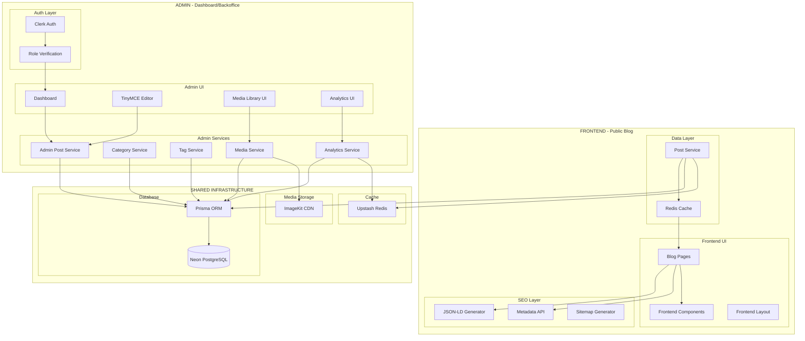

# Design Document: Advanced Web Blog

## Overview

This design describes an advanced web blog platform built with Next.js 16, leveraging the App Router for file-based routing, React Server Components for optimal performance, and database-driven content management with TinyMCE rich text editor. All posts are stored in Neon PostgreSQL database with HTML content, enabling full CRUD operations through the admin dashboard.

The platform includes full internationalization (i18n) support with automatic locale detection based on browser preferences, locale-prefixed URLs, and multi-language content management.

Additionally, the platform provides a comprehensive backend management system with Clerk authentication, TinyMCE WYSIWYG editor, post status management (draft/scheduled/published), category/tag management, ImageKit media library, and analytics dashboard.

The architecture prioritizes:
- **Performance**: Server-side rendering, Redis caching, image optimization via ImageKit CDN
- **Developer Experience**: TypeScript, TinyMCE editor, hot reloading
- **SEO**: Semantic HTML, meta tags, JSON-LD structured data, sitemap generation, hreflang tags
- **Accessibility**: WCAG 2.1 AA compliance, keyboard navigation, dark mode support
- **Internationalization**: Auto-detection, locale-prefixed URLs, fallback handling
- **Content Management**: Admin dashboard, TinyMCE editor, ImageKit media management, analytics

## Architecture

The application is split into two distinct parts with clear boundaries:



### Separation Principles

1. **Route Groups**: Frontend uses `app/[locale]/` and Admin uses `app/(admin)/` for clear separation
2. **Component Isolation**: `components/` for frontend and `components/admin/` for admin UI
3. **Library Organization**: `lib/` for shared logic, `lib/admin/` for admin-specific logic
4. **Shared Infrastructure**: Database, cache, and media services are shared via `lib/db/`, `lib/cache/`, `lib/media/`
5. **Authentication Boundary**: Clerk auth only applies to admin routes via middleware

### Directory Structure

```
================================================================================
FRONTEND (PUBLIC BLOG) - app/[locale]/
================================================================================

app/
├── [locale]/                       # Locale-prefixed routes
│   ├── layout.tsx                  # Locale layout with providers
│   ├── page.tsx                    # Homepage with post list
│   ├── blog/
│   │   ├── page.tsx                # Blog listing page
│   │   └── [slug]/
│   │       └── page.tsx            # Individual post page
│   ├── category/
│   │   └── [category]/
│   │       └── page.tsx            # Category filter page
│   ├── tag/
│   │   └── [tag]/
│   │       └── page.tsx            # Tag filter page
│   └── search/
│       └── page.tsx                # Search results page
├── layout.tsx                      # App root layout (shared)
├── sitemap.ts                      # Dynamic sitemap with alternates
└── middleware.ts                   # Locale detection & auth routing

lib/                                # Shared libraries
├── posts.ts                        # Post data fetching from database
├── search.ts                       # Search functionality
├── seo.ts                          # SEO utilities (JSON-LD, meta)
└── types.ts                        # TypeScript type definitions

lib/i18n/                           # Internationalization
├── config.ts                       # Supported locales, default locale
├── detection.ts                    # Locale detection logic
└── translations.ts                 # UI string translations

components/                         # Frontend components
├── PostCard.tsx                    # Post preview card
├── PostList.tsx                    # Paginated post list
├── PostHeader.tsx                  # Post metadata header
├── PostContent.tsx                 # HTML content renderer
├── Pagination.tsx                  # Pagination controls
├── SearchBar.tsx                   # Search input component
├── CategoryList.tsx                # Category navigation
├── TagList.tsx                     # Tag cloud/list
├── RelatedPosts.tsx                # Related posts section
├── ThemeToggle.tsx                 # Dark mode toggle
├── LocaleSwitcher.tsx              # Language selector component
├── LocaleFallbackNotice.tsx        # Fallback language notice
├── HeroSection.tsx                 # Homepage hero
└── SidebarWidgets.tsx              # Sidebar components

messages/                           # UI translations
├── en.json
├── es.json
├── fr.json
└── th.json

================================================================================
ADMIN DASHBOARD (BACKOFFICE) - app/(admin)/
================================================================================

app/
├── (admin)/                        # Route group for admin dashboard
│   ├── admin/
│   │   ├── layout.tsx              # Admin layout with sidebar + Clerk
│   │   ├── page.tsx                # Dashboard overview
│   │   ├── sign-in/
│   │   │   └── [[...sign-in]]/
│   │   │       └── page.tsx        # Clerk sign-in page
│   │   ├── posts/
│   │   │   ├── page.tsx            # Posts list
│   │   │   ├── new/
│   │   │   │   └── page.tsx        # Create post
│   │   │   └── [id]/
│   │   │       └── page.tsx        # Edit post
│   │   ├── categories/
│   │   │   └── page.tsx            # Category management
│   │   ├── tags/
│   │   │   └── page.tsx            # Tag management
│   │   ├── media/
│   │   │   └── page.tsx            # Media library
│   │   └── analytics/
│   │       └── page.tsx            # Analytics dashboard

lib/admin/                          # Admin-specific libraries
├── posts.ts                        # Admin post CRUD operations
├── categories.ts                   # Category management
├── tags.ts                         # Tag management
├── media.ts                        # Media upload via ImageKit
└── analytics.ts                    # Analytics queries with Redis caching

lib/auth/                           # Authentication (admin only)
├── clerk.ts                        # Clerk configuration and helpers
├── middleware.ts                   # Clerk auth middleware
└── roles.ts                        # Role-based access control

components/admin/                   # Admin-specific components (shadcn/ui)
├── Sidebar.tsx                     # Admin navigation sidebar
├── PostsTable.tsx                  # Posts data table
├── PostForm.tsx                    # Post create/edit form
├── RichTextEditor.tsx              # TinyMCE editor wrapper
├── MediaUploader.tsx               # Image upload component
├── MediaGrid.tsx                   # Media library grid
├── CategoryForm.tsx                # Category create/edit
├── TagForm.tsx                     # Tag create/edit
├── AnalyticsChart.tsx              # Analytics visualization (recharts)
├── StatsCard.tsx                   # KPI display card
├── StatusBadge.tsx                 # Post status indicator
├── ConfirmDialog.tsx               # Delete confirmation
├── DataTable.tsx                   # Reusable data table
├── DatePicker.tsx                  # Date picker for scheduling
└── SearchCommand.tsx               # Command palette search

================================================================================
SHARED INFRASTRUCTURE
================================================================================

lib/db/                             # Database (shared)
├── prisma.ts                       # Prisma client (Neon connection)
└── schema.prisma                   # Database schema

lib/cache/                          # Caching (shared)
├── redis.ts                        # Upstash Redis client
├── posts.ts                        # Post caching strategies
└── analytics.ts                    # Analytics caching

lib/media/                          # Media handling (shared)
├── imagekit.ts                     # ImageKit client configuration
└── upload.ts                       # Image upload utilities

lib/config/                         # Environment configuration (shared)
├── env.ts                          # Environment variable validation
├── database.ts                     # Database configuration
├── auth.ts                         # Auth configuration
├── cache.ts                        # Cache configuration
└── media.ts                        # Media configuration

components/ui/                      # shadcn/ui components (shared)
├── button.tsx
├── input.tsx
├── card.tsx
├── table.tsx
├── dialog.tsx
└── ... (other shadcn components)
```

## Components and Interfaces

### Post Service Interface

```typescript
interface PostService {
  getAllPosts(locale?: string): Promise<Post[]>;
  getPostBySlug(slug: string, locale?: string): Promise<Post | null>;
  getPostsByCategory(category: string, locale?: string): Promise<Post[]>;
  getPostsByTag(tag: string, locale?: string): Promise<Post[]>;
  searchPosts(query: string, locale?: string): Promise<SearchResult[]>;
  getRelatedPosts(post: Post, limit?: number): Promise<Post[]>;
  getAllCategories(): Promise<Category[]>;
  getAllTags(): Promise<Tag[]>;
}
```

### Search Interface

```typescript
interface SearchEngine {
  search(query: string, posts: Post[]): SearchResult[];
  highlightMatches(text: string, query: string): string;
}
```

### i18n Interfaces

```typescript
interface LocaleConfig {
  defaultLocale: string;
  supportedLocales: string[];
  fallbackLocale: string;
}

interface LocaleDetector {
  detectFromHeaders(headers: Headers): string;
  getPreferredLocale(request: Request): Promise<string>;
}

interface TranslationService {
  t(key: string, locale: string, params?: Record<string, string>): string;
  getTranslations(locale: string): Record<string, string>;
}

interface LocalizedPostService {
  getPostBySlugAndLocale(slug: string, locale: string): Promise<Post | null>;
  getAvailableLocales(slug: string): Promise<string[]>;
  getFallbackPost(slug: string, preferredLocale: string): Promise<{ post: Post; isFallback: boolean }>;
}
```

### Authentication Interfaces (Clerk)

```typescript
interface ClerkUser {
  id: string;
  email: string;
  firstName: string | null;
  lastName: string | null;
  imageUrl: string;
  publicMetadata: {
    role?: 'admin' | 'editor';
  };
}

interface AuthHelpers {
  isAdmin(userId: string): Promise<boolean>;
  requireAdmin(): Promise<ClerkUser>;
  getCurrentUser(): Promise<ClerkUser | null>;
}
```

### Cache Interfaces (Upstash Redis)

```typescript
interface CacheService {
  get<T>(key: string): Promise<T | null>;
  set<T>(key: string, value: T, ttlSeconds?: number): Promise<void>;
  del(key: string): Promise<void>;
  invalidatePattern(pattern: string): Promise<void>;
}

interface PostCache {
  getCachedPosts(locale: string): Promise<Post[] | null>;
  setCachedPosts(locale: string, posts: Post[]): Promise<void>;
  invalidatePostCache(slug?: string): Promise<void>;
}

interface AnalyticsCache {
  incrementPageView(postId: string): Promise<number>;
  getPageViews(postId: string): Promise<number>;
  flushViewsToDB(): Promise<void>;
}
```

### Admin Post Service Interface

```typescript
interface AdminPostService {
  getAllPosts(filters?: PostFilters): Promise<AdminPost[]>;
  getPostById(id: string): Promise<AdminPost | null>;
  createPost(data: CreatePostInput): Promise<AdminPost>;
  updatePost(id: string, data: UpdatePostInput): Promise<AdminPost>;
  deletePost(id: string): Promise<void>;
  publishPost(id: string): Promise<AdminPost>;
  schedulePost(id: string, publishAt: Date): Promise<AdminPost>;
  unpublishPost(id: string): Promise<AdminPost>;
}

interface PostFilters {
  status?: PostStatus;
  category?: string;
  search?: string;
  locale?: string;
}
```

### Media Service Interface (ImageKit)

```typescript
interface MediaService {
  uploadImage(file: File, folder?: string): Promise<MediaItem>;
  getAllMedia(page?: number): Promise<PaginatedMedia>;
  getMediaById(id: string): Promise<MediaItem | null>;
  deleteMedia(fileId: string): Promise<void>;
  getMediaUsage(id: string): Promise<Post[]>;
  getOptimizedUrl(path: string, transformations?: ImageKitTransform): string;
  getThumbnailUrl(path: string, width: number, height?: number): string;
}

interface ImageKitTransform {
  width?: number;
  height?: number;
  quality?: number;
  format?: 'auto' | 'webp' | 'avif' | 'jpg' | 'png';
  blur?: number;
  crop?: 'maintain_ratio' | 'force' | 'at_least' | 'at_max';
}
```

### Analytics Service Interface

```typescript
interface AnalyticsService {
  getDashboardStats(): Promise<DashboardStats>;
  getPostViews(postId: string, dateRange: DateRange): Promise<ViewStats>;
  getPopularPosts(limit: number): Promise<PostWithViews[]>;
  recordPageView(postId: string): Promise<void>;
}
```

### Environment Configuration Interface

```typescript
interface EnvConfig {
  database: DatabaseConfig;
  auth: AuthConfig;
  cache: CacheConfig;
  media: MediaConfig;
}

interface DatabaseConfig {
  url: string;           // DATABASE_URL - pooled connection
  directUrl: string;     // DIRECT_URL - direct connection for migrations
}

interface AuthConfig {
  publishableKey: string;  // NEXT_PUBLIC_CLERK_PUBLISHABLE_KEY
  secretKey: string;       // CLERK_SECRET_KEY
}

interface CacheConfig {
  redisUrl: string;        // UPSTASH_REDIS_REST_URL
  redisToken: string;      // UPSTASH_REDIS_REST_TOKEN
}

interface MediaConfig {
  publicKey: string;       // NEXT_PUBLIC_IMAGEKIT_PUBLIC_KEY
  privateKey: string;      // IMAGEKIT_PRIVATE_KEY
  urlEndpoint: string;     // NEXT_PUBLIC_IMAGEKIT_URL_ENDPOINT
}
```

## Data Models

### Post

```typescript
interface Post {
  id: string;
  slug: string;
  title: string;
  content: string;           // HTML content from TinyMCE
  excerpt: string;           // First 160 characters or custom
  author: Author;
  publishedAt: Date;
  updatedAt?: Date;
  category: string;
  tags: string[];
  readingTime: number;       // Minutes
  featured?: boolean;
  locale: string;
  status: PostStatus;
}

interface PostPreview {
  slug: string;
  title: string;
  excerpt: string;
  author: Author;
  publishedAt: Date;
  category: string;
  readingTime: number;
  locale: string;
}

type PostStatus = 'draft' | 'scheduled' | 'published';
```

### Author

```typescript
interface Author {
  id: string;
  name: string;
  avatar?: string;
  bio?: string;
  social?: {
    twitter?: string;
    github?: string;
  };
}
```

### Search Result

```typescript
interface SearchResult {
  post: PostPreview;
  matchedIn: ('title' | 'content' | 'tags')[];
  highlightedTitle: string;
  highlightedExcerpt: string;
}
```

### Category and Tag

```typescript
interface Category {
  id: string;
  name: string;
  slug: string;
  postCount: number;
}

interface Tag {
  id: string;
  name: string;
  slug: string;
  postCount: number;
}
```

### Locale

```typescript
interface Locale {
  code: string;        // e.g., 'en', 'es', 'fr'
  name: string;        // e.g., 'English', 'Español'
  nativeName: string;  // e.g., 'English', 'Español'
  direction: 'ltr' | 'rtl';
}

interface LocalizedPost extends Post {
  alternateLocales: { locale: string; slug: string }[];
}

interface LocalePreference {
  locale: string;
  source: 'cookie' | 'header' | 'default';
}
```

### Admin Data Models

```typescript
interface AdminPost extends Post {
  scheduledAt?: Date;
  createdAt: Date;
  viewCount: number;
}

interface CreatePostInput {
  title: string;
  content: string;        // HTML from TinyMCE
  excerpt?: string;
  category: string;
  tags: string[];
  locale: string;
  status: PostStatus;
  scheduledAt?: Date;
  authorId: string;
}

interface UpdatePostInput extends Partial<CreatePostInput> {
  id: string;
}

interface MediaItem {
  id: string;
  filename: string;
  url: string;
  thumbnailUrl: string;
  mimeType: string;
  size: number;
  width: number;
  height: number;
  uploadedAt: Date;
  uploadedBy: string;
}

interface PaginatedMedia {
  items: MediaItem[];
  total: number;
  page: number;
  pageSize: number;
}

interface DashboardStats {
  totalPosts: number;
  publishedPosts: number;
  draftPosts: number;
  totalViews: number;
  viewsThisWeek: number;
  popularPosts: PostWithViews[];
}

interface ViewStats {
  total: number;
  byDate: { date: string; views: number }[];
}

interface PostWithViews extends PostPreview {
  viewCount: number;
}

interface DateRange {
  start: Date;
  end: Date;
}
```


## Correctness Properties

*A property is a characteristic or behavior that should hold true across all valid executions of a system-essentially, a formal statement about what the system should do. Properties serve as the bridge between human-readable specifications and machine-verifiable correctness guarantees.*

### Property 1: Post ordering by date
*For any* collection of posts returned by `getAllPosts()`, the posts SHALL be ordered by `publishedAt` date in descending order (newest first).
**Validates: Requirements 1.1**

### Property 2: Post preview contains required fields
*For any* post preview generated from a valid post, the preview SHALL contain non-empty values for: title, excerpt (max 160 characters), author name, publication date, category, and reading time (positive integer).
**Validates: Requirements 1.2**

### Property 3: Pagination logic
*For any* collection of N posts with page size P, pagination SHALL display `ceil(N/P)` total pages, and page K SHALL contain posts at indices `[(K-1)*P, min(K*P, N))`.
**Validates: Requirements 1.4**

### Property 4: HTML content rendering
*For any* valid HTML content stored in the database, the system SHALL render it correctly with proper sanitization to prevent XSS attacks.
**Validates: Requirements 2.1, 5.2**

### Property 5: Related posts share taxonomy
*For any* post P and its related posts R, each post in R SHALL share at least one tag or the same category with P.
**Validates: Requirements 2.5**

### Property 6: Category filtering
*For any* category C and the result set R from `getPostsByCategory(C)`, every post in R SHALL have `category === C`, and R SHALL contain all posts with that category.
**Validates: Requirements 3.1**

### Property 7: Tag filtering
*For any* tag T and the result set R from `getPostsByTag(T)`, every post in R SHALL have T in its `tags` array, and R SHALL contain all posts with that tag.
**Validates: Requirements 3.2**

### Property 8: Search returns matching posts
*For any* non-empty search query Q and result set R, every post in R SHALL contain Q (case-insensitive) in its title, content, or tags.
**Validates: Requirements 4.1**

### Property 9: Search highlighting
*For any* search result with query Q, the highlighted title and excerpt SHALL contain markup wrapping all occurrences of Q.
**Validates: Requirements 4.2**

### Property 10: Empty search returns all posts
*For any* search query consisting only of empty string or whitespace characters, the search SHALL return all posts without filtering.
**Validates: Requirements 4.3**

### Property 11: HTML content sanitization
*For any* HTML content submitted through TinyMCE, the system SHALL sanitize potentially dangerous tags/attributes before storage.
**Validates: Requirements 5.3**

### Property 12: Slug generation
*For any* post title T, the generated slug SHALL be lowercase, contain only alphanumeric characters and hyphens, and be derivable from T.
**Validates: Requirements 6.4**

### Property 13: Sitemap completeness
*For any* set of published posts P, the generated sitemap SHALL contain exactly one URL entry for each post in P, plus alternate language URLs for localized versions.
**Validates: Requirements 6.3, 10.4**

### Property 14: Locale detection priority
*For any* request with browser Accept-Language header, the detected locale SHALL be the first supported locale from the header preferences, or the default locale if none match.
**Validates: Requirements 9.1**

### Property 15: Locale preference persistence
*For any* manually selected locale L, subsequent requests from the same session SHALL return L as the preferred locale regardless of browser headers.
**Validates: Requirements 9.3**

### Property 16: Locale URL structure
*For any* locale L and post slug S, the generated URL SHALL follow the pattern `/{L}/blog/{S}`.
**Validates: Requirements 11.1**

### Property 17: Locale fallback consistency
*For any* post P requested in locale L where L version does not exist, the system SHALL return the default locale version with `isFallback: true`.
**Validates: Requirements 9.4, 9.5**

### Property 18: Hreflang tag completeness
*For any* post with N available locale versions, the rendered page SHALL contain exactly N hreflang link tags, one for each available locale.
**Validates: Requirements 10.3**

### Property 19: Clerk authentication validity
*For any* Clerk session token, the system SHALL validate the token and extract user metadata including admin role.
**Validates: Requirements 12.2, 12.6**

### Property 20: Admin role verification
*For any* authenticated user attempting admin actions, the system SHALL verify the user has admin role in Clerk publicMetadata.
**Validates: Requirements 12.6**

### Property 21: Protected route access
*For any* admin route request without a valid Clerk session, the system SHALL redirect to the Clerk sign-in page.
**Validates: Requirements 12.1, 12.5**

### Property 22: Post CRUD consistency
*For any* post P created via `createPost()`, subsequent calls to `getPostById(P.id)` SHALL return the same post data, and after `deletePost(P.id)`, `getPostById(P.id)` SHALL return null.
**Validates: Requirements 13.3, 13.5**

### Property 23: Post status transitions
*For any* draft post, publishing SHALL change status to 'published' and set publishedAt; for scheduled posts, status SHALL change to 'published' when scheduledAt time is reached.
**Validates: Requirements 15.1, 15.2, 15.3**

### Property 24: Category uniqueness
*For any* category creation with name N, if a category with name N already exists, the creation SHALL fail with a validation error.
**Validates: Requirements 16.2**

### Property 25: Category deletion constraint
*For any* category C with associated posts, deletion SHALL fail until all posts are reassigned or deleted.
**Validates: Requirements 16.4**

### Property 26: Media upload validation
*For any* uploaded file F, the system SHALL validate file type is an allowed image format and size is within limits before storing.
**Validates: Requirements 17.2**

### Property 27: Media deletion constraint
*For any* media item M referenced by posts, deletion SHALL require confirmation and warn about affected posts.
**Validates: Requirements 17.4**

### Property 28: Cache consistency
*For any* post update operation, the Redis cache SHALL be invalidated for that post and related list caches.
**Validates: Requirements 8.1**

### Property 29: Cache hit returns valid data
*For any* cached post data, the returned data SHALL match the structure and content of the database record at cache time.
**Validates: Requirements 8.1**

### Property 30: Environment variable validation
*For any* required environment variable that is missing or empty, the system SHALL throw a descriptive error identifying the missing variable and prevent initialization.
**Validates: Requirements 19.5**

### Property 31: Database configuration from environment
*For any* valid DATABASE_URL and DIRECT_URL environment variables, the Prisma client SHALL be configured with those exact connection strings.
**Validates: Requirements 19.1, 19.6**

### Property 32: Auth configuration from environment
*For any* valid Clerk environment variables, the Clerk client SHALL be initialized with those credentials and all auth operations SHALL use the real Clerk API.
**Validates: Requirements 19.2, 19.7**

### Property 33: Cache configuration from environment
*For any* valid Upstash Redis environment variables, the Redis client SHALL be configured with those credentials and all cache operations SHALL use the real Upstash service.
**Validates: Requirements 19.3, 19.8**

### Property 34: Media configuration from environment
*For any* valid ImageKit environment variables, the ImageKit client SHALL be configured with those credentials and all image URLs SHALL use the ImageKit CDN endpoint.
**Validates: Requirements 19.4, 19.9**

## Error Handling

### Content Errors

| Error Type | Handling Strategy |
|------------|-------------------|
| Invalid HTML content | Sanitize content, log warning |
| Missing post | Return 404 page |
| Database connection failure | Display error page, retry with backoff |

### Runtime Errors

| Error Type | Handling Strategy |
|------------|-------------------|
| Search index failure | Fall back to basic string matching |
| Image load failure | Display placeholder with alt text |
| Theme preference read failure | Default to system preference |

### Admin Errors

| Error Type | Handling Strategy |
|------------|-------------------|
| Authentication failure | Display error message, log attempt |
| Session expired | Redirect to login with message |
| Unauthorized access | Return 403, redirect to dashboard |
| Database connection failure | Display error page, retry with backoff |
| File upload failure | Display error, allow retry |
| Validation error | Display field-specific error messages |
| Duplicate category/tag | Display conflict error message |

### Environment Configuration Errors

| Error Type | Handling Strategy |
|------------|-------------------|
| Missing DATABASE_URL | Log error with variable name, throw startup error |
| Missing CLERK keys | Log error with variable names, throw startup error |
| Missing UPSTASH credentials | Log error with variable names, throw startup error |
| Missing IMAGEKIT credentials | Log error with variable names, throw startup error |
| Invalid connection string format | Log error with details, throw startup error |
| Database connection timeout | Log error, retry with exponential backoff |
| Redis connection failure | Log warning, fall back to no-cache mode |
| ImageKit API error | Log error, fall back to local image serving |

## Testing Strategy

### Testing Framework

- **Unit Testing**: Vitest for fast, TypeScript-native testing
- **Property-Based Testing**: fast-check library for generating test cases
- **Component Testing**: React Testing Library for component behavior

### Unit Tests

Unit tests will cover:
- Slug generation edge cases (special characters, unicode)
- Reading time calculation accuracy
- Pagination boundary conditions
- Search query normalization
- HTML sanitization

### Property-Based Tests

Each correctness property will be implemented as a property-based test using fast-check:

1. **Post ordering**: Generate random posts with dates, verify sorted order
2. **Preview fields**: Generate posts, verify all required fields present
3. **Pagination**: Generate varying post counts, verify page calculations
4. **HTML rendering**: Generate valid HTML strings, verify sanitization
5. **Related posts**: Generate posts with overlapping tags, verify relationships
6. **Category filtering**: Generate posts with categories, verify filter accuracy
7. **Tag filtering**: Generate posts with tags, verify filter accuracy
8. **Search matching**: Generate posts and queries, verify matches contain query
9. **Search highlighting**: Generate text and queries, verify highlight markup
10. **Empty search**: Generate whitespace strings, verify all posts returned
11. **HTML sanitization**: Generate HTML with dangerous tags, verify removal
12. **Slug generation**: Generate titles, verify slug format constraints
13. **Sitemap completeness**: Generate post sets with locales, verify sitemap coverage
14. **Locale detection**: Generate Accept-Language headers, verify correct locale selection
15. **Locale persistence**: Generate locale selections, verify cookie persistence
16. **Locale URL structure**: Generate locale/slug pairs, verify URL format
17. **Locale fallback**: Generate posts with missing locales, verify fallback behavior
18. **Hreflang tags**: Generate multi-locale posts, verify tag completeness
19-21. **Authentication**: Generate credentials, verify session handling
22. **Post CRUD**: Generate posts, verify create/read/update/delete consistency
23. **Post status**: Generate status transitions, verify correct state changes
24-25. **Category management**: Generate categories, verify uniqueness and deletion constraints
26-27. **Media management**: Generate files, verify validation and deletion constraints
28-29. **Cache**: Generate post updates, verify cache invalidation and data validity
30-34. **Environment config**: Generate env vars, verify configuration

### Test Configuration

```typescript
// vitest.config.ts
export default defineConfig({
  test: {
    environment: 'jsdom',
    globals: true,
    setupFiles: ['./tests/setup.ts'],
  },
});
```

Property tests will run with minimum 100 iterations:

```typescript
fc.assert(
  fc.property(postArbitrary, (post) => {
    // Property assertion
  }),
  { numRuns: 100 }
);
```

Each property-based test will be annotated with:
```typescript
// **Feature: advanced-web-blog, Property 1: Post ordering by date**
```
