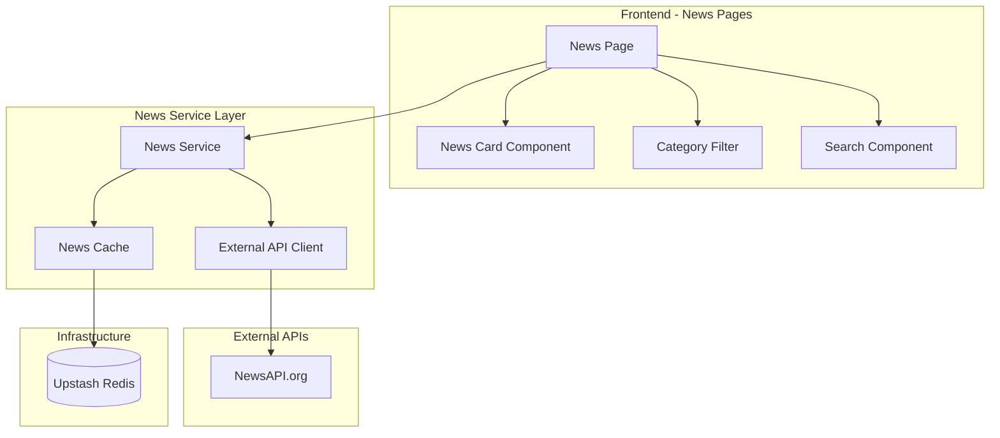

# Design Document: External News Feed

## Overview

ฟีเจอร์นี้เพิ่มความสามารถในการดึงข่าวจาก API ภายนอก (เช่น NewsAPI.org) มาแสดงในแพลตฟอร์ม NewsLoop โดยแยกจากบทความที่สร้างในระบบ ระบบจะแคชข่าวใน Redis เพื่อลด API calls และรองรับการกรอง/ค้นหาข่าว

สถาปัตยกรรมออกแบบให้:
- **Performance**: แคชข่าวใน Redis, lazy loading images
- **Reliability**: Fallback เมื่อ API ไม่พร้อมใช้งาน, จัดการ rate limits
- **Scalability**: รองรับหลาย news sources
- **i18n**: รองรับหลายภาษาตามระบบเดิม

## Architecture



### Directory Structure

```
app/
├── [locale]/
│   ├── layout.tsx                # Existing locale layout (shared)
│   ├── page.tsx                  # Homepage
│   ├── blog/                     # Existing blog routes
│   └── news/
│       ├── page.tsx              # News listing page (uses locale from params)
│       └── category/
│           └── [category]/
│               └── page.tsx      # News by category page

lib/
├── news/
│   ├── index.ts                  # Barrel export
│   ├── types.ts                  # News types
│   ├── client.ts                 # External API client
│   ├── service.ts                # News service with caching
│   └── cache.ts                  # Redis cache for news

lib/config/
└── news.ts                       # News configuration

components/
├── NewsCard.tsx                  # News item card
├── NewsList.tsx                  # News list with pagination
├── NewsFilter.tsx                # Category filter
└── NewsSearch.tsx                # Search input

messages/
├── en.json                       # Add news translations
├── es.json
├── fr.json
└── th.json
```

### URL Structure (Locale-Prefixed)

```
/en/news                          # English news listing
/th/news                          # Thai news listing
/es/news                          # Spanish news listing
/en/news/category/technology      # English tech news
/th/news/category/business        # Thai business news
```

หน้า news จะใช้ locale จาก URL params เหมือนหน้าอื่นๆ ในระบบ และใช้ layout เดียวกับ `[locale]/layout.tsx` ที่มีอยู่แล้ว

## Components and Interfaces

### News Service Interface

```typescript
interface NewsService {
  getNews(options: NewsQueryOptions): Promise<NewsResponse>;
  getNewsByCategory(category: string, options?: NewsQueryOptions): Promise<NewsResponse>;
  searchNews(query: string, options?: NewsQueryOptions): Promise<NewsResponse>;
  getCategories(): NewsCategory[];
}

interface NewsQueryOptions {
  page?: number;
  pageSize?: number;
  locale: string;              // Required - from URL params
  category?: string;
  query?: string;
}

interface NewsResponse {
  articles: NewsArticle[];
  totalResults: number;
  page: number;
  pageSize: number;
  totalPages: number;
}
```

### External API Client Interface

```typescript
interface NewsAPIClient {
  fetchTopHeadlines(params: HeadlinesParams): Promise<APIResponse>;
  fetchEverything(params: EverythingParams): Promise<APIResponse>;
}

interface HeadlinesParams {
  country?: string;
  category?: string;
  pageSize?: number;
  page?: number;
}

interface EverythingParams {
  q: string;
  language?: string;
  pageSize?: number;
  page?: number;
}

interface APIResponse {
  status: string;
  totalResults: number;
  articles: RawNewsArticle[];
}
```

### News Cache Interface

```typescript
interface NewsCache {
  get(key: string): Promise<NewsResponse | null>;
  set(key: string, data: NewsResponse, ttlSeconds?: number): Promise<void>;
  invalidate(pattern: string): Promise<void>;
  generateKey(options: NewsQueryOptions): string;
}
```

### Configuration Interface

```typescript
interface NewsConfig {
  apiKey: string;
  apiBaseUrl: string;
  enabled: boolean;
  defaultPageSize: number;
  cacheTTL: number;
  supportedCategories: string[];
  supportedLocales: string[];
}
```

## Data Models

### NewsArticle

```typescript
interface NewsArticle {
  id: string;                    // Generated from URL hash
  title: string;
  description: string | null;
  content: string | null;
  url: string;                   // Original article URL
  imageUrl: string | null;
  source: NewsSource;
  publishedAt: Date;
  category?: string;
}

interface NewsSource {
  id: string | null;
  name: string;
}
```

### NewsCategory

```typescript
interface NewsCategory {
  id: string;
  name: string;
  slug: string;
}

const NEWS_CATEGORIES: NewsCategory[] = [
  { id: 'general', name: 'General', slug: 'general' },
  { id: 'business', name: 'Business', slug: 'business' },
  { id: 'technology', name: 'Technology', slug: 'technology' },
  { id: 'entertainment', name: 'Entertainment', slug: 'entertainment' },
  { id: 'health', name: 'Health', slug: 'health' },
  { id: 'science', name: 'Science', slug: 'science' },
  { id: 'sports', name: 'Sports', slug: 'sports' },
];
```

### Cache Key Structure

```typescript
// Cache key format: news:{locale}:{category}:{query}:{page}
// Examples:
// news:en:technology::1
// news:th:general::1
// news:en::bitcoin:1
```

## Correctness Properties

*A property is a characteristic or behavior that should hold true across all valid executions of a system-essentially, a formal statement about what the system should do. Properties serve as the bridge between human-readable specifications and machine-verifiable correctness guarantees.*

### Property 1: News ordering by date
*For any* collection of news articles returned by `getNews()`, the articles SHALL be ordered by `publishedAt` date in descending order (newest first).
**Validates: Requirements 1.1**

### Property 2: News item contains required fields
*For any* news article displayed, the rendered output SHALL contain non-empty values for: title, source name, publication date, and URL.
**Validates: Requirements 1.2**

### Property 3: Pagination calculation
*For any* collection of N news articles with page size P, pagination SHALL display `ceil(N/P)` total pages, and page K SHALL contain articles at indices `[(K-1)*P, min(K*P, N))`.
**Validates: Requirements 1.4**

### Property 4: Category filtering
*For any* category C and the result set R from `getNewsByCategory(C)`, every article in R SHALL belong to category C.
**Validates: Requirements 2.1**

### Property 5: Search returns matching articles
*For any* non-empty search query Q and result set R from `searchNews(Q)`, every article in R SHALL contain Q (case-insensitive) in its title or description.
**Validates: Requirements 3.1**

### Property 6: Empty search returns all news
*For any* search query consisting only of empty string or whitespace characters, the search SHALL return all news without filtering.
**Validates: Requirements 3.2**

### Property 7: Disabled source exclusion
*For any* News_Source S that is disabled, the result set from `getNews()` SHALL NOT contain articles from source S.
**Validates: Requirements 4.2**

### Property 8: Cache stores fetched data
*For any* successful API fetch, the News_System SHALL store the results in Redis cache with the configured TTL.
**Validates: Requirements 5.1**

### Property 9: Cache hit prevents API call
*For any* request where valid cached data exists, the News_System SHALL return cached data without calling the external API.
**Validates: Requirements 5.2**

### Property 10: Cache miss triggers API call
*For any* request where cache is empty or expired, the News_System SHALL fetch from the external API and update the cache.
**Validates: Requirements 5.3**

### Property 11: Locale parameter in API request
*For any* locale L in the supported locales list, API requests SHALL include the language parameter matching L.
**Validates: Requirements 7.1**

### Property 12: Unsupported locale fallback
*For any* locale L not supported by the news API, the News_System SHALL request news in English as fallback.
**Validates: Requirements 7.3**

### Property 13: Rate limit extends cache TTL
*For any* rate limit warning from the API, the News_System SHALL extend the cache TTL to reduce subsequent API calls.
**Validates: Requirements 8.2**

## Error Handling

| Error Type | Handling Strategy |
|------------|-------------------|
| API key missing | Log error, disable news feature gracefully |
| API rate limit (429) | Serve cached data, extend cache TTL, retry after wait time |
| API unavailable (5xx) | Serve stale cached data if available, log warning |
| API timeout | Serve cached data, log warning |
| Invalid API response | Log error, return empty results |
| Cache connection failure | Bypass cache, fetch directly from API |
| Network error | Display error message, offer retry |

## Testing Strategy

### Testing Framework

- **Unit Testing**: Vitest for fast, TypeScript-native testing
- **Property-Based Testing**: fast-check library for generating test cases
- **Mocking**: MSW (Mock Service Worker) for API mocking in tests

### Unit Tests

Unit tests will cover:
- News service methods
- Cache key generation
- API response transformation
- Error handling scenarios
- Configuration validation

### Property-Based Tests

Each correctness property will be implemented as a property-based test using fast-check:

1. **News ordering**: Generate random articles with dates, verify sorted order
2. **Required fields**: Generate articles, verify all required fields present
3. **Pagination**: Generate varying article counts, verify page calculations
4. **Category filtering**: Generate articles with categories, verify filter accuracy
5. **Search matching**: Generate articles and queries, verify results contain query
6. **Empty search**: Generate whitespace strings, verify all news returned
7. **Cache behavior**: Verify cache stores and retrieves correctly
8. **Locale handling**: Generate locales, verify correct API parameters

### Test Configuration

```typescript
// Property tests should run minimum 100 iterations
const PBT_CONFIG = {
  numRuns: 100,
  verbose: true,
};
```

