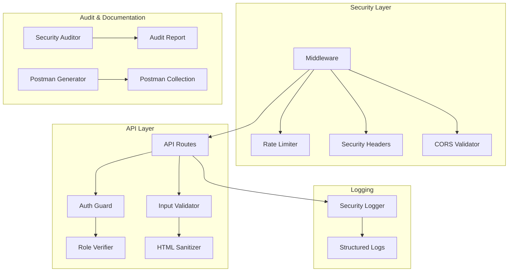

# Design Document: OWASP Security Audit + Postman API Documentation

## Overview

เอกสารนี้ออกแบบระบบ Security Audit ตามมาตรฐาน OWASP Top 10 2025 สำหรับ NewsLoop API พร้อมทั้งสร้าง Postman Collection สำหรับทดสอบและเป็น API documentation

### เป้าหมาย
1. ตรวจสอบช่องโหว่ความปลอดภัยตาม OWASP Top 10 2025
2. สร้าง security utilities และ middleware สำหรับป้องกันการโจมตี
3. สร้าง Postman Collection ที่ครบถ้วนสำหรับทุก API endpoint
4. สร้าง Security Audit Report สรุปผลการตรวจสอบ

## Architecture



## Components and Interfaces

### 1. Security Headers Middleware

```typescript
// lib/security/headers.ts
interface SecurityHeadersConfig {
  contentSecurityPolicy: string;
  xFrameOptions: 'DENY' | 'SAMEORIGIN';
  xContentTypeOptions: 'nosniff';
  referrerPolicy: string;
  permissionsPolicy: string;
}

function getSecurityHeaders(): Record<string, string>;
function applySecurityHeaders(response: NextResponse): NextResponse;
```

### 2. Rate Limiter

```typescript
// lib/security/rate-limit.ts
interface RateLimitConfig {
  windowMs: number;      // Time window in milliseconds
  maxRequests: number;   // Max requests per window
  keyPrefix: string;     // Redis key prefix
}

interface RateLimitResult {
  allowed: boolean;
  remaining: number;
  resetAt: Date;
}

async function checkRateLimit(
  identifier: string, 
  config: RateLimitConfig
): Promise<RateLimitResult>;
```

### 3. Input Validator

```typescript
// lib/security/validation.ts
import { z } from 'zod';

// URL validation schema
const urlSchema = z.string().url().refine(
  (url) => isAllowedDomain(url),
  { message: 'URL domain not allowed' }
);

// File upload validation
interface FileValidationResult {
  valid: boolean;
  mimeType: string;
  error?: string;
}

function validateFileUpload(
  buffer: Buffer, 
  filename: string, 
  allowedTypes: string[]
): FileValidationResult;

function isInternalIP(url: string): boolean;
function isAllowedDomain(url: string): boolean;
```

### 4. Security Logger

```typescript
// lib/security/logger.ts
interface SecurityEvent {
  type: 'AUTH_FAILURE' | 'AUTHZ_FAILURE' | 'RATE_LIMIT' | 'VALIDATION_ERROR' | 'SUSPICIOUS_ACTIVITY';
  timestamp: Date;
  userId?: string;
  ip?: string;
  userAgent?: string;
  endpoint: string;
  details: Record<string, unknown>;
}

function logSecurityEvent(event: SecurityEvent): void;
function formatStructuredLog(event: SecurityEvent): string;
```

### 5. Postman Collection Generator

```typescript
// scripts/generate-postman.ts
interface PostmanCollection {
  info: {
    name: string;
    description: string;
    schema: string; // v2.1.0
  };
  item: PostmanFolder[];
  variable: PostmanVariable[];
}

interface PostmanFolder {
  name: string;
  description: string;
  item: PostmanRequest[];
}

interface PostmanRequest {
  name: string;
  description: string;
  request: {
    method: string;
    header: PostmanHeader[];
    url: PostmanUrl;
    body?: PostmanBody;
  };
  response: PostmanResponse[];
}

function generatePostmanCollection(): PostmanCollection;
function exportToFile(collection: PostmanCollection, path: string): void;
```

### 6. Security Audit Report Generator

```typescript
// scripts/security-audit.ts
interface SecurityFinding {
  id: string;
  category: OWASPCategory;
  severity: 'CRITICAL' | 'HIGH' | 'MEDIUM' | 'LOW' | 'INFO';
  title: string;
  description: string;
  affectedFiles: string[];
  remediation: string;
  codeExample?: string;
}

type OWASPCategory = 
  | 'A01_BROKEN_ACCESS_CONTROL'
  | 'A02_CRYPTOGRAPHIC_FAILURES'
  | 'A03_INJECTION'
  | 'A04_INSECURE_DESIGN'
  | 'A05_SECURITY_MISCONFIGURATION'
  | 'A06_VULNERABLE_COMPONENTS'
  | 'A07_AUTH_FAILURES'
  | 'A08_DATA_INTEGRITY'
  | 'A09_LOGGING_MONITORING'
  | 'A10_SSRF';

interface AuditReport {
  generatedAt: Date;
  summary: {
    total: number;
    bySeverity: Record<string, number>;
    byCategory: Record<OWASPCategory, number>;
  };
  findings: SecurityFinding[];
  recommendations: string[];
}

function runSecurityAudit(): Promise<AuditReport>;
function generateMarkdownReport(report: AuditReport): string;
```

## Data Models

### Security Event Log Schema

```typescript
interface SecurityLogEntry {
  id: string;
  timestamp: Date;
  eventType: string;
  severity: 'INFO' | 'WARNING' | 'ERROR' | 'CRITICAL';
  userId?: string;
  sessionId?: string;
  ipAddress?: string;
  userAgent?: string;
  endpoint: string;
  method: string;
  statusCode?: number;
  message: string;
  metadata: Record<string, unknown>;
}
```

### Postman Collection Schema (v2.1)

```typescript
// Follows Postman Collection Format v2.1.0
// https://schema.postman.com/collection/json/v2.1.0/draft-07/collection.json
interface PostmanCollectionV21 {
  info: {
    _postman_id: string;
    name: string;
    description: string;
    schema: 'https://schema.getpostman.com/json/collection/v2.1.0/collection.json';
  };
  item: (PostmanFolder | PostmanRequest)[];
  variable: Array<{
    key: string;
    value: string;
    type: 'string';
  }>;
}
```

## Correctness Properties

*A property is a characteristic or behavior that should hold true across all valid executions of a system-essentially, a formal statement about what the system should do. Properties serve as the bridge between human-readable specifications and machine-verifiable correctness guarantees.*

### Property 1: Unauthenticated Access Rejection
*For any* protected admin endpoint and any request without valid authentication, the API SHALL return HTTP 401 status code.
**Validates: Requirements 1.1**

### Property 2: Role-Based Access Enforcement
*For any* admin-only endpoint and any request with editor role, the API SHALL return HTTP 403 status code.
**Validates: Requirements 1.2**

### Property 3: HTML Sanitization Completeness
*For any* HTML input containing XSS patterns (script tags, event handlers, javascript: URLs), the sanitized output SHALL NOT contain any of those dangerous patterns.
**Validates: Requirements 3.2**

### Property 4: File Type Validation
*For any* file upload with disallowed MIME type, the API SHALL reject the upload with appropriate error message.
**Validates: Requirements 3.3**

### Property 5: Pagination Limit Enforcement
*For any* API request with limit parameter exceeding MAX_LIMIT, the response SHALL contain at most MAX_LIMIT items.
**Validates: Requirements 4.3**

### Property 6: Error Message Sanitization
*For any* API error response, the response body SHALL NOT contain stack traces, file paths, or internal system details.
**Validates: Requirements 4.4**

### Property 7: Unsupported Method Rejection
*For any* API endpoint and any HTTP method not explicitly supported, the API SHALL return HTTP 405 status code.
**Validates: Requirements 5.4**

### Property 8: Authentication Error Consistency
*For any* failed authentication attempt (invalid user, invalid password, or non-existent user), the error message SHALL be identical to prevent user enumeration.
**Validates: Requirements 7.2**

### Property 9: Input Schema Validation
*For any* API request with malformed input data, the API SHALL reject the request with validation error before processing.
**Validates: Requirements 8.1**

### Property 10: Security Event Logging Format
*For any* logged security event, the log entry SHALL contain timestamp, event type, and relevant context in structured JSON format.
**Validates: Requirements 9.1, 9.4**

### Property 11: Internal IP Blocking
*For any* URL pointing to internal network addresses (127.0.0.1, 10.x.x.x, 192.168.x.x, localhost), the API SHALL reject the request.
**Validates: Requirements 10.2**

### Property 12: Sensitive Data Log Exclusion
*For any* log entry, the content SHALL NOT contain passwords, API keys, tokens, or other sensitive credentials.
**Validates: Requirements 2.4**

## Error Handling

### Security-Related Errors

| Error Type | HTTP Status | Response Format |
|------------|-------------|-----------------|
| Unauthenticated | 401 | `{ "error": "Authentication required" }` |
| Unauthorized | 403 | `{ "error": "Insufficient permissions" }` |
| Rate Limited | 429 | `{ "error": "Too many requests", "retryAfter": <seconds> }` |
| Validation Error | 400 | `{ "error": "Validation failed", "details": [...] }` |
| Method Not Allowed | 405 | `{ "error": "Method not allowed" }` |

### Error Logging Strategy

1. **Log all security events** - Authentication failures, authorization denials, rate limit hits
2. **Exclude sensitive data** - Never log passwords, tokens, or PII
3. **Include context** - User ID, IP, endpoint, timestamp
4. **Use structured format** - JSON for easy parsing and analysis

## Testing Strategy

### Dual Testing Approach

ใช้ทั้ง Unit Tests และ Property-Based Tests เพื่อครอบคลุมการทดสอบ:

#### Unit Tests
- ทดสอบ specific examples และ edge cases
- ทดสอบ integration points ระหว่าง components
- ทดสอบ error conditions ที่เฉพาะเจาะจง

#### Property-Based Tests
- ใช้ **fast-check** library สำหรับ TypeScript
- ทดสอบ universal properties ที่ต้อง hold สำหรับทุก input
- Run minimum 100 iterations per property

### Test Categories

1. **Access Control Tests**
   - Test all protected endpoints without auth
   - Test role-based access with different roles
   - Test resource ownership validation

2. **Input Validation Tests**
   - Test HTML sanitization with various XSS payloads
   - Test file upload validation with different file types
   - Test URL validation for SSRF prevention

3. **Rate Limiting Tests**
   - Test rate limit enforcement
   - Test rate limit reset behavior

4. **Security Header Tests**
   - Verify all required headers are present
   - Test header values are correct

### Property Test Annotations

ทุก property-based test ต้องมี comment ระบุ:
```typescript
/**
 * **Feature: owasp-security-audit, Property 3: HTML Sanitization Completeness**
 * **Validates: Requirements 3.2**
 */
```
