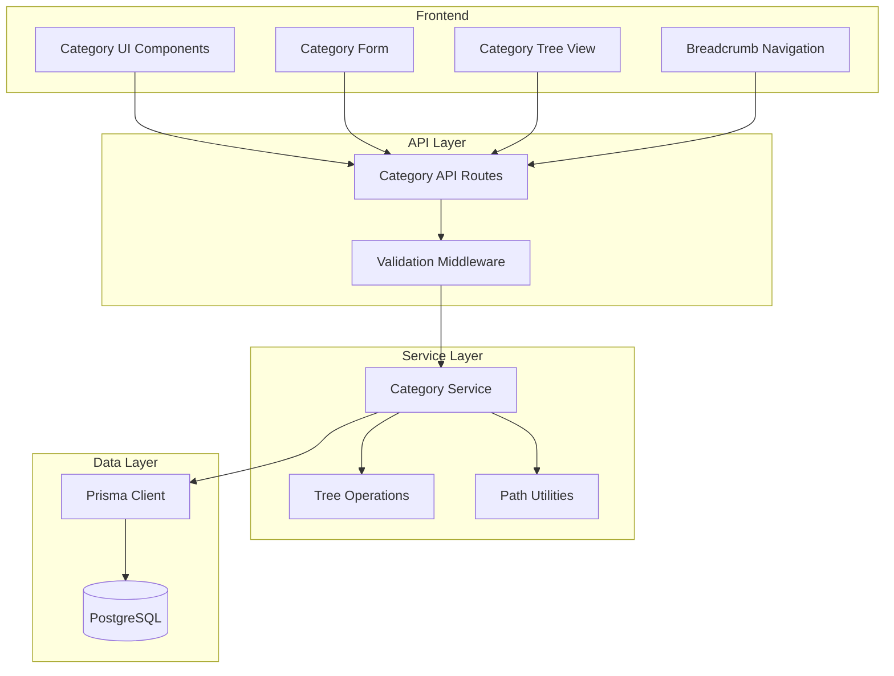

# Subcategories Feature Design

## Overview

This design document describes the implementation of hierarchical subcategories for the blog platform. The feature transforms the existing flat category structure into a tree-based hierarchy, enabling categories to have parent-child relationships with a maximum depth of 3 levels.

The implementation uses a self-referential parent pointer pattern in the database, with utility functions for tree traversal, path serialization, and depth validation.

## Architecture

### High-Level Architecture



### Data Flow

1. Admin creates/edits category → Form submits to API → Service validates hierarchy → Database updated
2. Reader views category → API fetches category with ancestors/descendants → UI renders breadcrumb and tree
3. Post assignment → Form displays hierarchical dropdown → Service associates post with selected category

## Components and Interfaces

### Database Schema Changes

```prisma
model Category {
  id          String     @id @default(cuid())
  name        String
  slug        String     @unique
  description String?
  parentId    String?
  parent      Category?  @relation("CategoryHierarchy", fields: [parentId], references: [id])
  children    Category[] @relation("CategoryHierarchy")
  depth       Int        @default(0)
  createdAt   DateTime   @default(now())
  updatedAt   DateTime   @updatedAt

  posts Post[]

  @@unique([parentId, name])
  @@index([parentId])
}
```

### Core Interfaces

```typescript
// Category with hierarchy information
interface CategoryNode {
  id: string;
  name: string;
  slug: string;
  description?: string;
  parentId: string | null;
  depth: number;
  children?: CategoryNode[];
  postCount?: number;
}

// Category path representation
interface CategoryPath {
  segments: string[];  // Array of category names from root to leaf
  ids: string[];       // Array of category IDs from root to leaf
}

// Tree operation result
interface TreeOperationResult {
  success: boolean;
  category?: CategoryNode;
  error?: string;
}

// Hierarchical category for dropdowns
interface HierarchicalCategory {
  id: string;
  name: string;
  slug: string;
  depth: number;
  path: string;  // Full path like "Technology > Web Development > React"
  children: HierarchicalCategory[];
}
```

### Service Interface

```typescript
interface CategoryService {
  // CRUD with hierarchy support
  createCategory(data: CreateCategoryInput): Promise<CategoryNode>;
  updateCategory(id: string, data: UpdateCategoryInput): Promise<CategoryNode>;
  deleteCategory(id: string, reassignTo?: string): Promise<void>;
  
  // Tree operations
  getCategoryTree(): Promise<CategoryNode[]>;
  getCategoryWithAncestors(id: string): Promise<CategoryNode[]>;
  getCategoryWithDescendants(id: string): Promise<CategoryNode>;
  moveCategory(id: string, newParentId: string | null): Promise<CategoryNode>;
  
  // Path utilities
  getCategoryPath(id: string): Promise<CategoryPath>;
  serializePath(path: CategoryPath): string;
  parsePath(pathString: string): CategoryPath;
  
  // Validation
  validateDepth(parentId: string | null): Promise<boolean>;
  validateNoCycle(categoryId: string, newParentId: string): Promise<boolean>;
}
```

## Data Models

### Category Tree Structure

```
Root Categories (depth: 0)
├── Technology (depth: 0)
│   ├── Web Development (depth: 1)
│   │   ├── React (depth: 2)
│   │   └── Vue (depth: 2)
│   └── Mobile (depth: 1)
│       └── iOS (depth: 2)
└── Lifestyle (depth: 0)
    └── Travel (depth: 1)
```

### Path Serialization Format

- Delimiter: `/` (forward slash)
- Example: `Technology/Web Development/React`
- Empty path: empty string `""`
- Single category: `Technology`

### Depth Calculation

- Root categories: `depth = 0`
- Subcategories: `depth = parent.depth + 1`
- Maximum allowed depth: `2` (allowing 3 levels: 0, 1, 2)


## Correctness Properties

*A property is a characteristic or behavior that should hold true across all valid executions of a system-essentially, a formal statement about what the system should do. Properties serve as the bridge between human-readable specifications and machine-verifiable correctness guarantees.*

### Property 1: Category Creation Respects Parent Selection

*For any* valid category name and optional parent category, creating a category should result in:
- If parent is provided: `category.parentId === parent.id` and `category.depth === parent.depth + 1`
- If no parent: `category.parentId === null` and `category.depth === 0`

**Validates: Requirements 1.2, 1.3**

### Property 2: Duplicate Name Validation Within Parent

*For any* parent category (or null for root) and any existing category name under that parent, attempting to create another category with the same name and parent should be rejected.

**Validates: Requirements 1.5**

### Property 3: Tree Structure Correctness

*For any* set of categories with parent-child relationships, building the category tree should produce a structure where:
- Each category appears exactly once
- Each category's children array contains exactly its direct children
- Root categories have no parent in the tree

**Validates: Requirements 1.4, 4.4**

### Property 4: Move Preserves Descendants and Posts

*For any* category with children and/or posts, moving it to a new valid parent should:
- Preserve the count of descendant categories
- Preserve the count of associated posts
- Update depths of all descendants correctly (new depth = new parent depth + 1 + relative depth)

**Validates: Requirements 2.2, 2.4**

### Property 5: Cycle Prevention

*For any* category C and any category D in C's descendant tree (including C itself), attempting to set D as C's parent should be rejected.

**Validates: Requirements 2.3**

### Property 6: Deletion Reassigns Children to Grandparent

*For any* category with children, deleting it should result in all children having:
- `parentId` equal to the deleted category's original `parentId`
- `depth` equal to the deleted category's original `depth`

**Validates: Requirements 3.2**

### Property 7: Deletion Blocked When Posts Exist

*For any* category with associated posts, attempting to delete without specifying a reassignment target should be rejected.

**Validates: Requirements 3.3**

### Property 8: Ancestor Path Completeness

*For any* category at depth N, retrieving its ancestor path should return exactly N+1 categories (including itself), ordered from root to the category.

**Validates: Requirements 4.1, 5.3**

### Property 9: Children Include Accurate Post Counts

*For any* parent category, fetching its children should return categories where each child's `postCount` equals the actual number of posts directly assigned to that child.

**Validates: Requirements 4.2**

### Property 10: Descendant Post Aggregation

*For any* category, fetching posts with `includeDescendants: true` should return all posts from the category plus all posts from every category in its descendant tree.

**Validates: Requirements 4.3**

### Property 11: Depth Enforcement

*For any* category at depth 2 (the maximum), attempting to create a child category should be rejected.

**Validates: Requirements 6.1, 6.2**

### Property 12: Depth Equals Ancestor Count

*For any* category, its `depth` value should equal the number of ancestors (categories in the path from root to parent).

**Validates: Requirements 6.3**

### Property 13: Path Serialization Round-Trip

*For any* valid CategoryPath, serializing it to a string and then parsing that string should produce an equivalent CategoryPath with identical segments.

**Validates: Requirements 7.1, 7.2, 7.3**

## Error Handling

### Validation Errors

| Error Code | Condition | Message |
|------------|-----------|---------|
| `DUPLICATE_NAME` | Category name exists under same parent | "A category with this name already exists under the selected parent" |
| `MAX_DEPTH_EXCEEDED` | Creating child would exceed depth 3 | "Cannot create subcategory: maximum nesting depth (3 levels) reached" |
| `CYCLE_DETECTED` | Moving category would create cycle | "Cannot move category: would create circular reference" |
| `HAS_POSTS` | Deleting category with posts without reassignment | "Cannot delete category with posts. Please reassign posts first" |
| `INVALID_PARENT` | Parent category doesn't exist | "Selected parent category does not exist" |
| `SELF_REFERENCE` | Setting category as its own parent | "A category cannot be its own parent" |

### Error Response Format

```typescript
interface CategoryError {
  code: string;
  message: string;
  details?: {
    categoryId?: string;
    parentId?: string;
    affectedCount?: number;
  };
}
```

## Testing Strategy

### Property-Based Testing

The project uses **fast-check** for property-based testing with **Vitest** as the test runner.

Each property-based test will:
- Run a minimum of 100 iterations
- Use smart generators that produce valid category hierarchies
- Be tagged with the format: `**Feature: subcategories, Property {number}: {property_text}**`

### Generators

```typescript
// Generate valid category name
const categoryNameArb = fc.string({ minLength: 1, maxLength: 100 })
  .filter(s => s.trim().length > 0);

// Generate category tree up to specified depth
const categoryTreeArb = (maxDepth: number) => fc.letrec(tie => ({
  node: fc.record({
    name: categoryNameArb,
    children: maxDepth > 0 
      ? fc.array(tie('node'), { maxLength: 3 })
      : fc.constant([])
  })
})).node;

// Generate valid category path
const categoryPathArb = fc.array(categoryNameArb, { minLength: 1, maxLength: 3 })
  .map(segments => ({ segments, ids: segments.map(() => generateId()) }));
```

### Unit Tests

Unit tests will cover:
- Edge cases: empty category names, special characters in names
- Boundary conditions: exactly at max depth, moving root to root
- Error conditions: all validation error scenarios
- Integration: category service with Prisma client

### Test File Organization

```
lib/
├── categories/
│   ├── tree.ts           # Tree operations
│   ├── tree.test.ts      # Tree unit tests
│   ├── path.ts           # Path utilities
│   ├── path.test.ts      # Path unit + property tests
│   ├── validation.ts     # Validation functions
│   └── validation.test.ts # Validation tests
└── admin/
    ├── categories.ts     # Category service (updated)
    └── categories.test.ts # Service tests
```
